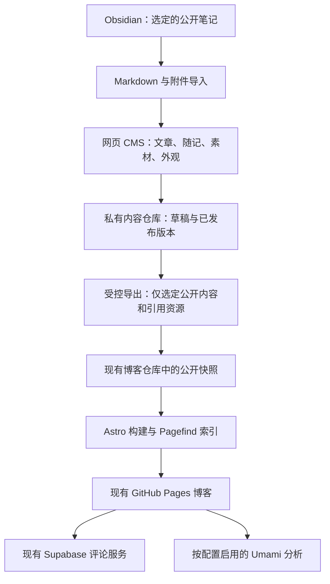

# 现成博客与管理方案调研：SunTBurst 架构完善建议

调研日期：2026-09-08。本文补充同日《博客现状评估与调整建议》，属于选型与设计建议，不是实施完成记录。

**状态更新：用户随后明确要求“免费 GitHub 托管、不额外架设服务器、最小代码改动”。本文以下的 CMS＋私有内容仓库＋Supabase＋Umami 组合不再作为推荐实施方案，只保留为调研记录。当前有效范围见 [免费 GitHub 托管与最小改动方案](2026-09-08-blog-review.md)。优先使用 GitHub 自带编辑、既有 Actions、现有内容及界面组件，不引入外部后台服务。**

## 1. 推荐结论

建议继续使用当前 Astro 静态博客，保留现有 TS LOGO、蓝黄识别、文章 URL 和已有内容集合。视觉借鉴 AstroPaper 的阅读层级、Fuwari 的轻量图片与配置能力，以及合荒小站对随记和个人身份的呈现。

功能上，优先采用“现成 CMS＋Markdown 文件＋静态发布”，并保留已开发的 Supabase 评论模块。正文搜索优先采用 Pagefind；真实访问分析优先评估 Umami。只定制 Obsidian 内容适配、发布状态、主题配置和必要的管理整合。

**对上一轮建议的调整：不再默认将文章、草稿和版本全部迁入 Supabase 并从零开发内容后台。先验证基于 Git 的 CMS 能否满足编辑需求；Supabase 继续承担已有评论能力。** 若 CMS 不能可靠保存复杂 Markdown，或必须实现完全统一的登录与操作界面，再采用定制后台路线。

现成 CMS 的首选验证对象是 Sveltia CMS，备选包括 Pages CMS 和 Decap。Sveltia 不是已确认可直接投入本项目生产的最终选型：官方仍标注 beta，2026-09-08 查到的最新发布标签为 v0.208.1。是否采用，以本文第 7 节的实测标准决定。[Sveltia 项目状态](https://sveltiacms.app/en/docs/intro#project-status)、[本次查到的发布版本](https://github.com/sveltia/sveltia-cms/releases/tag/v0.208.1)

## 2. 参考博客：哪些值得借鉴

### 用户提供的两个参考

**合荒小站。** 实际浏览了首页、文章页、公开仪表盘和作者介绍近期改动的文章。当前页脚标注 Hugo / Liquid Stack；首页有清楚的个人身份、近期说说、文章列表、分类和归档。适合借鉴的是个人内容的组织和轻量展示。公开仪表盘显示文章数量、字数、分类和发布活跃度，不能据此认定其具备私有文章管理或真实访客统计。[首页](https://hehuang.site/)、[仪表盘](https://hehuang.site/dashboard/)

继续追溯 Liquid Stack 源码，确认上游包含 Sveltia CMS 配置、素材集合和管理链接菜单。管理菜单把 CMS、评论、部署、分析等目的地放在一起，其中还有外部链接或占位地址；它不是统一后端。上游示例中的部分评论与访问数据也明确为演示。没有登录合荒小站的后台，不能把上游 CMS 能力当成该站已启用事实。[Liquid Stack](https://github.com/Jingyuan-Zheng/Liquid-Stack)、[管理链接配置](https://github.com/Jingyuan-Zheng/Liquid-Stack/blob/main/data/management_links.yaml)

**ImUpXuu/myblog。** 仓库 README 明确说明已经废弃并迁往 xuhome；旧项目是 Fuwari 的定制版本。其相册、移动目录和友链流程可作为设计参考，不宜作为新的维护基线。[myblog README](https://github.com/ImUpXuu/myblog)

**ImUpXuu/xuhome。** 这是当前 SunTBurst 骨架的来源。本次查看了当前 README 和源码目录：其阅读增强、分享、说说及外部服务组织可继续参考，但没有从目录检索和写作说明中找到可据此确认的完整网页发帖后台。README 中有 AI 功能描述，目录中也有归档 AI 组件，因此不能仅凭功能表判定每项功能当前实际运行。[xuhome](https://github.com/ImUpXuu/xuhome)

### 扩展比较

下表“建议”是针对本项目的判断；“参考能力”来自项目官方说明或实际页面，不表示已经在 SunTBurst 集成验证。

| 参考 | 参考能力 | 对 SunTBurst 的建议 |
| --- | --- | --- |
| [AstroPaper](https://github.com/satnaing/astro-paper) / [实站](https://astro-paper.pages.dev/) | 克制的文章列表、键盘访问、折叠目录、Pagefind、文章分享图片 | 最适合参考阅读层级与简洁导航；继续使用自己的中文排版与 LOGO。 |
| [Fuwari](https://github.com/saicaca/fuwari) / [实站](https://fuwari.vercel.app/) | 可配置主题色与横幅、分类标签、目录、Pagefind、Markdown 增强 | 借鉴图片与配色的配置方式，缩小首页横幅，控制动画数量。 |
| [Mizuki 主仓库](https://github.com/LyraVoid/Mizuki) | 可配置侧栏、专题页面、文章别名与固定地址、Wiki Links、内容仓库分离 | 借鉴模块开关和配置边界。功能较多，整套替换可能再次增加复杂度。 |
| [Liquid Stack](https://github.com/Jingyuan-Zheng/Liquid-Stack) | 浏览器 CMS、结构化站点数据、管理入口、图集和内容仪表盘 | 借鉴“内容也能通过表单管理”；Hugo 模板不直接移植进 Astro。 |
| [Quartz](https://quartz.jzhao.xyz/) | Obsidian 兼容、双链、嵌入、反向链接、悬停预览和图谱 | 参考公开笔记关联功能；首版先做双链和反向链接，图谱保持可选。 |
| [Halo](https://www.halo.run/) | 编辑器、附件、主题配置、备份和后台扩展 | 可作为统一后台的功能参照。若整体采用，会引入不同运行架构。 |
| [Ghost](https://docs.ghost.org/) | 完整出版平台、管理与迁移体系 | 纳入替代平台比较，但现阶段整体迁移不符合沿用当前功能架构的方向。 |

Quartz 当前官网已是 v5；不要直接照搬旧版插件配置。部分搜索结果中的 Mizuki 旧地址当前指向一个 fork，本次用 README 指明的 LyraVoid/Mizuki 作为主仓库参考。

本次直接查看了合荒小站、Fuwari 和 AstroPaper 的浏览器界面。其他主题以官方文档、仓库和公开元数据为依据，未声称完成实际功能验收。

## 3. 后台选型：CMS 与编辑器要分开比较

博客主题解决展示，CMS 解决内容编辑与存储；Vditor 这类编辑器只解决正文输入，不自带完整的认证、存储、评论或发布系统。

| 方案 | 与当前项目的适配 | 已核实的限制 | 建议排序 |
| --- | --- | --- | --- |
| [Sveltia CMS](https://sveltiacms.app/en/docs/intro) | 通过 Git 读写 Markdown 和 YAML/JSON；可配置文章、素材和站点设置；有原始 Markdown 模式 | beta；依赖 Git 身份和仓库权限；普通 GitHub OAuth 需要认证服务；不自带本站统计和评论管理 | 首选验证，固定版本，保留退出路径 |
| [Pages CMS](https://pagescms.org/docs/) | 在现有 GitHub 文件之上提供内容、媒体编辑层；有 GitHub App 配置方式 | 托管版是外部编辑入口；当前自托管版需要 Node 应用、PostgreSQL 和认证配置 | 注重现成内容管理的备选 |
| [Decap CMS](https://decapcms.org/docs/editorial-workflows/) | Markdown、图片及基于分支/PR 的草稿发布流程 | 仍需要配置身份验证；公开仓库中的草稿分支不保密 | 兼容性备选，用相同内容样本比较 |
| [Keystatic](https://keystatic.com/docs/installation-astro) | 官方支持 Astro 和 GitHub 模式，字段模型适合开发者维护 | 部署后台需服务器端能力和适配器；Markdoc 可存为 .md，但扩展语法和渲染仍需适配 | 可用，但对当前纯静态部署改动更大 |
| [TinaCMS](https://tina.io/docs/frameworks/astro) | 官方提供 Astro 编辑与可视化接入路径 | 可编辑区域需接入其桥接及内容体系，完整站内可视化编辑不是加一个按钮即可完成 | 用户明确重视页面内点选编辑时再深入 |
| [Vditor](https://github.com/Vanessa219/vditor)＋定制后台 | 提供 Markdown 分屏、即时渲染及所见即所得模式 | 需要自行补充身份、草稿、素材、冲突控制、版本和发布服务 | CMS 无法满足核心体验时的定制路线 |

参考：[Pages CMS 自托管要求](https://pagescms.org/docs/guides/installing/self-host/)、[Keystatic Markdoc 字段](https://keystatic.com/docs/fields/markdoc)

### Sveltia 的适配边界

官方支持将 Markdown 字段配置为 raw 模式，也说明富文本编辑使用 Lexical，不能直接注册本站的 remark 插件。因此方案应是：正文优先原始 Markdown 编辑，预览另行对齐 Astro 的解析规则。[编辑模式与插件限制](https://sveltiacms.app/en/docs/fields/richtext)

它支持基于分支的编辑流程，但“已经写进 Git”“合并发布分支”“网站部署成功”仍然是不同状态。删除已发布内容也有单独的待删除流程，需要按其实际行为设计按钮文案。[编辑工作流](https://sveltiacms.app/en/docs/workflows/editorial)

不要预先承诺以下能力：跨设备自动保存与冲突锁、后台一键恢复历史版本、定时发布、表格的完整富文本编辑、本站完全一致的即时预览。其中一部分仍在官方路线图中，另一些需要项目自行接入。[官方路线图](https://sveltiacms.app/en/docs/roadmap)

Sveltia 通过 Git 服务身份和权限控制内容访问，不自动复用 Supabase 评论登录。可以先统一入口与视觉；若必须所有管理功能只登录一次，需设计权限整合或采用定制后台，不能把多个链接包装成已实现单点登录。[GitHub 后端认证](https://sveltiacms.app/en/docs/backends/github)

## 4. 在当前架构上完善的具体方案

### 4.1 保留的部分

- Astro 静态输出、GitHub Pages 公开地址及现有文章/知识/说说 URL。
- 五类 Markdown 内容集合，先统一管理界面，不急于混成同一物理目录。
- 现有蓝黄 LOGO、作者身份、内容和图片。
- Supabase 评论领域模型及发布前审核要求。
- 已有 RSS、收藏、阅读进度、主题切换等功能，按实测情况收敛实现。

### 4.2 推荐的内容关系

这是本项目的建议架构，不是任何一个 CMS 开箱即有的完整组合。

**代码、内容分开管理。** 新建私有内容仓库作为文章与站点可编辑数据的单一来源，公开博客仓库保留代码和已发布快照。现有文章导入后保留原 slug 和地址。Obsidian 和 CMS 最终编辑同一份内容，不建立自动相互覆盖的两个源。

**私有草稿单独处理。** 草稿分支、历史版本、未公开图片都留在私有仓库。发布任务按允许清单导出已发布内容及实际引用的附件。不会因为一篇文章发布，就把整个附件目录或整个 Obsidian 库送到公开仓库。

**发布过程继续自动化。** 在私有内容仓库内验证并导出公开快照，通过专用发布身份写入现有博客仓库的限定内容目录，触发现有 Pages 工作流。部署完成状态需回到管理界面；CMS 的“保存成功”不能当作“网站已上线”。保持当前域名不需要立即更换托管平台。

**发布权限与 CMS 权限分开。** CMS 按 Git 仓库权限验证编辑者；发布自动化只读取必要内容，只写公开快照目录。普通访客登录评论不获得仓库写权限。后台独立来源部署，避免公开页面脚本接触 CMS 的仓库访问凭据。

**撤回也走完整流程。** 文章撤回需同步移除公开页面、搜索索引、RSS、站点地图及相应公开附件引用，停用评论目标。保留旧 slug 与内容 ID 的关系。已公开 Git 历史中的内容不能通过普通撤稿保证彻底消失。

这条路线仍需要一次内容仓库、认证和发布自动化配置，并非零部署成本。它的收益是减少自建文章数据库、版本系统和整个素材后台的工作。

### 4.3 完整定制路线何时更合适

如果你最终要求“在同一个界面内、只登录一次、自动保存、原位编辑、直接恢复版本”，并且现成 CMS 的正文保存或预览不达标，则使用成熟 Markdown 编辑器加 Supabase 定制后台。

此时 Supabase 保存文章、草稿和版本，Git 仅保留公开快照；不能让 Git CMS 和数据库同时成为文章编辑源。该路线整合程度更高，但开发和维护范围明显增加。当前不建议同时实现两条路线。

## 5. 最值得吸收的功能及优先级

优先级是建议实施顺序，尚未代表用户批准全部新增功能。

| 功能 | 当前情况 | 建议方案 | 优先级 |
| --- | --- | --- | --- |
| 浏览器写作、编辑与发布 | 尚缺完整流程 | 验证 Sveltia/Pages CMS；编辑器默认 Markdown，表单管理文章属性 | 第一批 |
| 草稿与素材保密 | 目前只有构建时 draft 过滤 | 私有内容源＋仅导出公开内容；未公开附件不进入 public | 第一批 |
| Obsidian 导入 | 目前需手工整理图片地址 | 文章＋附件导入、双链解析、缺失资源清单、frontmatter 映射 | 第一批 |
| 全文搜索 | 当前主要检索标题与摘要 | Pagefind 索引实际正文，结果显示命中片段；保留现有搜索外观 | 第一批 |
| 背景和风格管理 | 只有访客深浅色切换 | CMS 编辑结构化外观配置，预览后发布；保留 TS LOGO | 第一批 |
| 发布进度 | 目前依赖仓库构建流程 | 显示保存、构建、上线和失败；对应具体版本 | 第一批 |
| 评论管理 | 已有审核代码，外部启用待完成 | 保留现有 Supabase 方案，补齐列表与状态，接入管理入口 | 第二批 |
| 真实访问分析 | 当前是内容统计 | 接入 Umami；概览看趋势、热门文章和来源，排除后台及博主访问 | 第二批 |
| 移动目录和阅读布局 | 已有基础，页面重复装饰较多 | 保留并统一已有目录实现；正文优先，短文隐藏空目录 | 第二批 |
| 系列文章、反向链接 | 尚未形成明确功能 | 参考 Quartz；只连接已公开内容，先列表后图谱 | 第二批 |
| 分享预览图 | 已有分享链接等基础 | 构建时生成包含原 LOGO、文章标题和日期的 OG 图片 | 第二批 |
| 图片优化与相册 | 当前以本地图片和灯箱为主 | 图片尺寸、懒加载和缩略图先做好；相册仅在有实际内容时加入 | 后续可选 |
| 友链更新聚合 | 当前有友链与书签 | 可做低频 RSS 聚合，先保证可维护的申请和审核，不自动扩大范围 | 后续可选 |
| AI 摘要和问答 | 当前是本地资料导览 | 优先后台辅助摘要并经博主确认；公开问答待内容规模足够再做 | 后续可选 |
| 音乐、天气、随机漫游等 | 已有本地或按需功能 | 保留次级入口，集中到工具页，可配置关闭 | 收敛入口 |

Pagefind 支持中文分词，其官方文档说明专门语言处理依赖 extended 版本，当前 `npx pagefind` 默认使用该版本。构建时应只索引正文，排除导航、页脚、后台和草稿，并用中文长短词及中英文混排验证效果。[Pagefind 入门](https://pagefind.app/docs/)、[中文和多语言支持](https://pagefind.app/docs/multilingual/)

技术文章的代码块可评估 Expressive Code，但应替换现有重复逻辑，而不是额外叠加一套复制按钮或高亮组件。[Expressive Code](https://expressive-code.com/)

Umami 有浏览量、访客、来源和 API 等能力；具体选择托管版或自托管版，需结合预算与现有服务确认。本项目只需要基础统计，不默认加入会话回放、热力图或营销分析。[Umami 官方文档](https://docs.umami.is/docs)

Giscus 将评论依托 GitHub Discussions，是减少评论服务维护的备选，但不能直接当成现有“AI 审核后才公开”的等价替代。本轮建议保留现有评论方案，不同时接入两套评论。[Giscus](https://giscus.app/zh-CN)

## 6. 前台和后台如何更清楚

### 前台

LOGO 返回首页，主要栏目围绕“文章、随记、专题、关于”组织；项目、友链和工具放到次级入口，按实际内容量决定是否提升。现有栏目保留地址与访问能力，先减少重复入口。

首页采用简短身份介绍、近期文章和随记。图片可使用后续创建的原创素材，但配色和标识延续现有蓝黄。文章页使用浅色干净阅读区；卡片仍可保留方形感，减少处处粗描边与硬阴影。

### 后台

以五组入口组织功能：

1. 概览：新建文章、待处理事项和发布状态；真实统计启用后增加摘要。
2. 内容：文章、随记、知识、项目及更新；常用类型排在前面。
3. 素材：图片、封面、替代文字和引用关系。
4. 评论：接入已有审核服务。
5. 设置：个人介绍、导航、主题、首页图片、功能开关。

如果使用现成 CMS，内容、素材和设置可以放在 CMS 内；评论和统计初期保留各自受保护的管理页面。入口整合与身份整合分别验收，避免“看起来一个后台，实际权限不清楚”。

### 配置与功能边界

将可编辑站点数据从 TypeScript 配置中分离为受校验的 YAML/JSON，程序配置继续留在代码中。公开设置包括主题预设、背景、导航和模块显示；服务密钥不进入 CMS 配置或公开仓库。

每个可选模块统一记录：是否对访客可见、功能是否配置完成、显示位置和排序。默认不展示未启用的大块说明；后台显示待配置原因。文章列表、分类和标签使用同一套内容查询和组件，避免新旧实现继续并存。

## 7. 建议的落地顺序与选型验收

### 阶段一：编辑方案验证

对 Sveltia 的固定版本先做一个有限范围样例：一篇普通长文、一篇含中文表格/公式/代码/callout/双链的文章、一条含图片的随记。随后按同样样本比较必要的备选，不同时铺开多个生产 CMS。

必须确认：

- 正文保存再打开后语义不丢失，特别是公式、双链、表格、脚注、缩进和中文输入。
- frontmatter 日期时区、slug 和未知属性的处理明确；不能静默更改已发布地址。
- 插图上传和引用可靠；缺少 Obsidian 本地附件时明确提示。
- 原始 Markdown 模式保持可用；不强迫经富文本模式来回转换。
- 预览与 Astro 正式渲染一致；不能通过在管理来源执行任意 HTML/MDX 来实现兼容。
- 匿名访客和普通评论用户不能读草稿或写内容；直接调用接口同样受限。
- Git 草稿分支、附件和预览页面均按私有内容处理。
- 发布失败不误报上线；重复发布不创建重复文章；撤回可从所有公开产物中移除。
- 跨设备或本地与网页同时编辑发生冲突时不静默覆盖。
- 所用版本、权限、部署资源和维护成本有记录。

如果 Sveltia 的数据保存或安全权限不达标，先比较 Pages CMS/Decap；如果只有定制编辑器能满足你的工作方式，再采用 Vditor 等组件＋自有发布服务。当前研究没有运行这些 CMS 的真实账户登录、写入或跨设备测试。

### 阶段二：生产写作闭环

完成私有内容源、CMS 认证、受控公开导出和 Pages 发布反馈，再导入现有内容。验收以“通过网页发出并再次修改一篇真实文章”为准，不以编辑器页面出现为准。

### 阶段三：阅读与管理完善

接入 Pagefind，统一外观配置和文章组件，完成评论服务与真实统计。保留旧链接和 RSS 地址。按已有访问功能调整入口，随后才考虑相册、系列和可选 AI。

## 8. 维护与证据边界

- 调研使用官方项目文档、GitHub README/配置/目录及公开仓库元数据。代码和素材均未复制进应用。
- GitHub 元数据核查显示 Fuwari、AstroPaper、Sveltia、Pages CMS、Keystatic、Quartz 和 Mizuki 主仓库未被平台标记为归档；这不等于稳定性或维护质量已经验收。
- myblog 的停止使用来自作者 README，不能与 GitHub 的 archived 标记混为一谈。
- Liquid Stack 声明 GPL v3 或更新版本，Fuwari/AstroPaper/Sveltia 等相关仓库声明 MIT，Mizuki 主仓库声明 Apache-2.0。具体代码复用时逐文件保留相应来源与许可；本文仅借鉴设计和架构。
- xuhome README 声明了代码许可，但仓库元数据未识别许可证，沿用现有来源说明，后续复制新代码前检查具体文件授权。
- 未获取任何第三方后台权限，未发送评论，未创建账户，未安装外部 CMS，未改动线上网站。
- CMS 兼容性、单点登录、私有内容发布和统计费用仍属于下一步验证/配置事项，本文没有把它们记为已实现。
- 本轮没有应用代码变更，因此未重复上一轮的类型检查、108 项测试与构建。上一轮结果只代表当时的本地基线。

本轮产物为此调研文档，以及在原评估文档中增加的调研修订指引。
